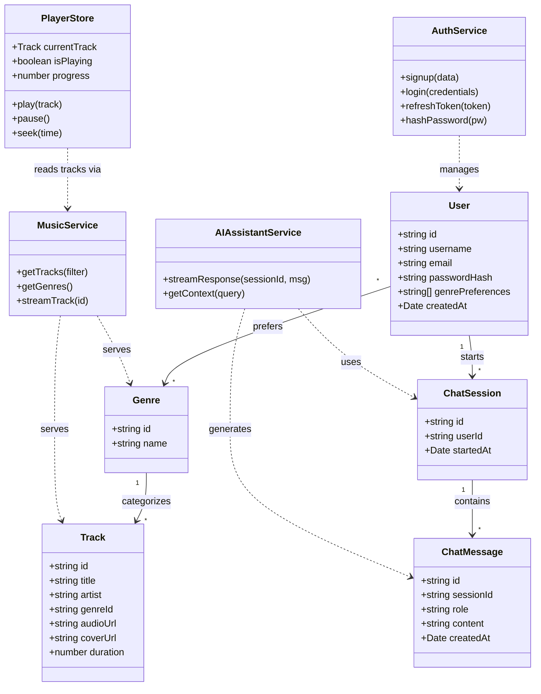

# Anaska — Class Diagram
 
Layered pyramid: State layer (top) -> Service layer (middle) -> Data layer (base).
 

 
## How to view this in VS Code
 
1. Install the **Markdown Preview Mermaid Support** extension (or **Mermaid Markdown Syntax Highlighting**).
2. Open this file and press `Ctrl+Shift+V` (or `Cmd+Shift+V` on Mac) to open the Markdown preview — the diagram renders inline.
3. Alternatively, paste just the code inside the triple-backtick block into [mermaid.live](https://mermaid.live) to view or export it as PNG/SVG.
 